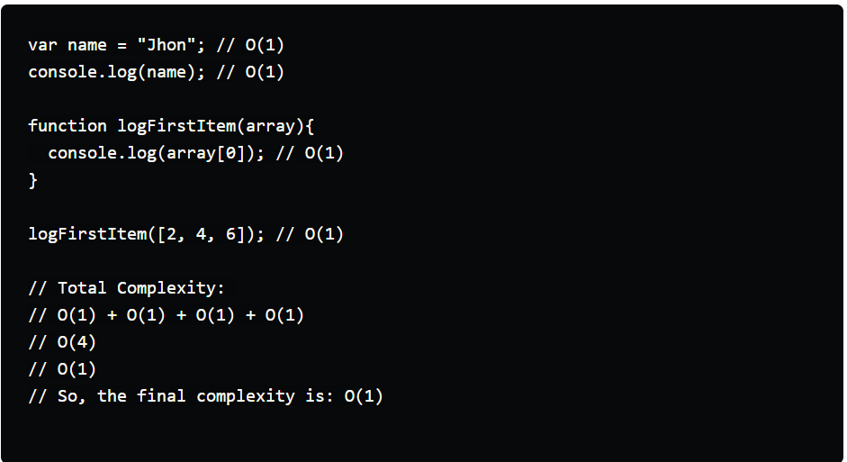
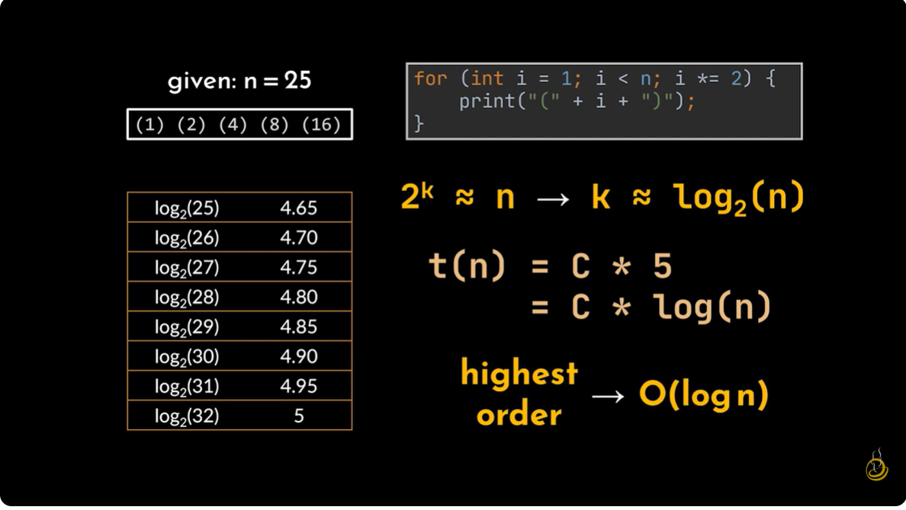
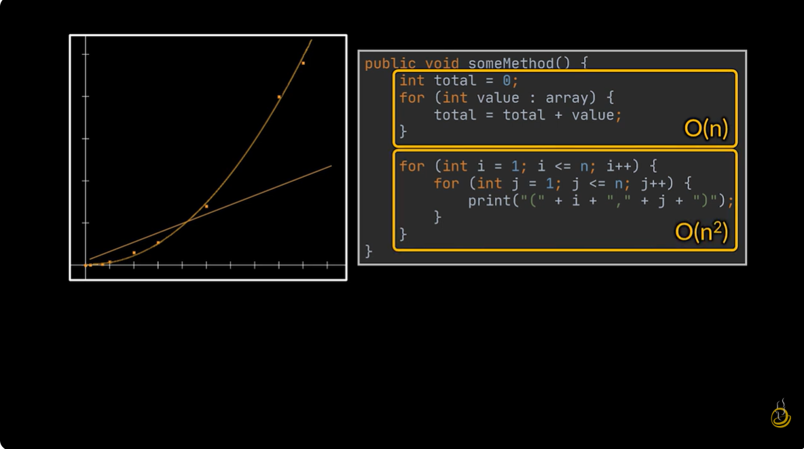
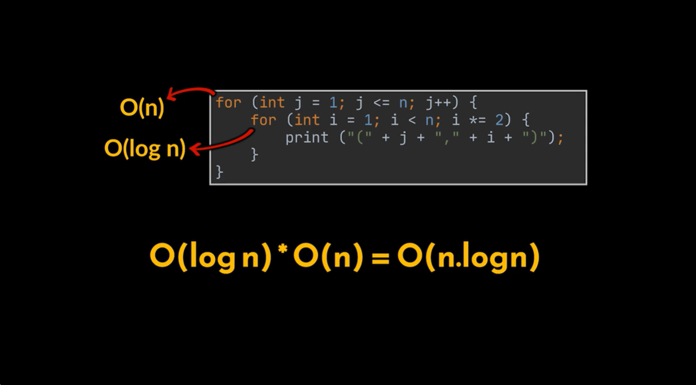
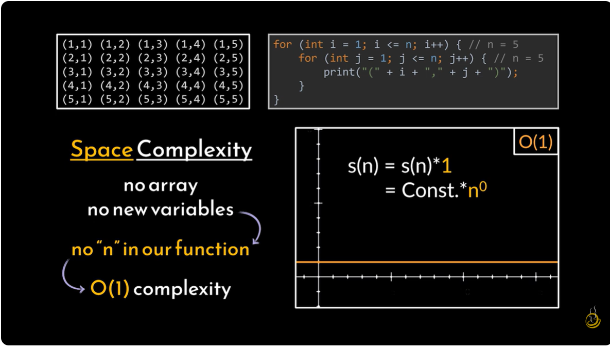

### What is Data Structures and Algorithms (DSA)?

Data Structures and Algorithms (DSA) is a fundamental skill in computer science, **essential for solving complex problems efficiently**, writing better code, and excelling in technical interviews. 

- A **data structure** is a way of organizing and storing data efficiently, while an **algorithm** is a set of step-by-step instructions to solve a specific problem using that data.

- **Time & Space Complexity** is crucial for evaluating how well your code performs. Focus on *Big O notation* to measure an algorithm's time and memory usage as the input size grows. 

### What is Time Complexity?
**Answer:** Time complexity is a concept in computer science that describes the amount of time an algorithm takes to run, as a function of the length of its input.
*Common time complexities:*
**O(1) - Constant Time:**
Execution time is fixed, regardless of the input size (e.g., accessing an element in an array).

**O(log n) - Logarithmic Time:**
The algorithm reduces the problem size in each step (e.g., binary search).

**O(n) - Linear Time:**
Time grows directly and linearly with the input size (e.g., traversing an array).

**O(n log n) - Log-linear Time:**
Common in efficient sorting algorithms (e.g., Merge Sort, Quick Sort average case).

**O(n²) - Quadratic Time:**
Time grows proportionally to the square of the input size (e.g., nested loops, Bubble Sort). 

### What is Space Complexity?
**Answer:** Space complexity measures the total amount of memory an algorithm requires to run to completion, also expressed using Big O notation. 

**Fixed Part:** Memory needed for the program code, simple variables, and constants, which is independent of the input size.

**Variable Part:** Memory that depends on the input size, such as dynamic memory allocation for arrays or objects, and the recursion call stack. 

