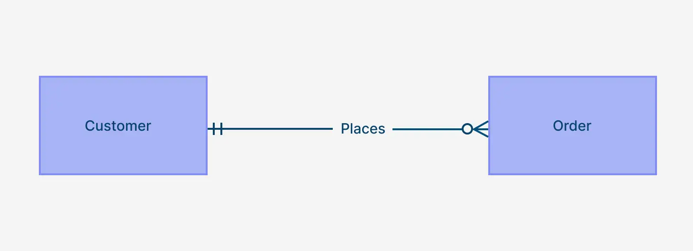
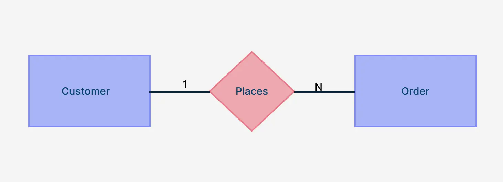
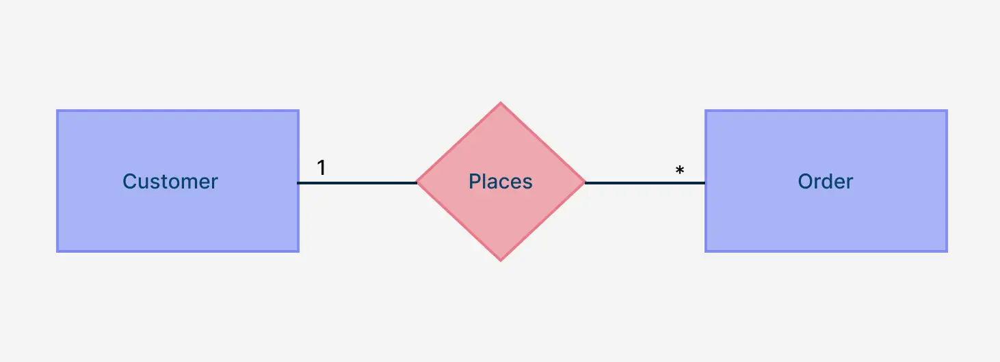
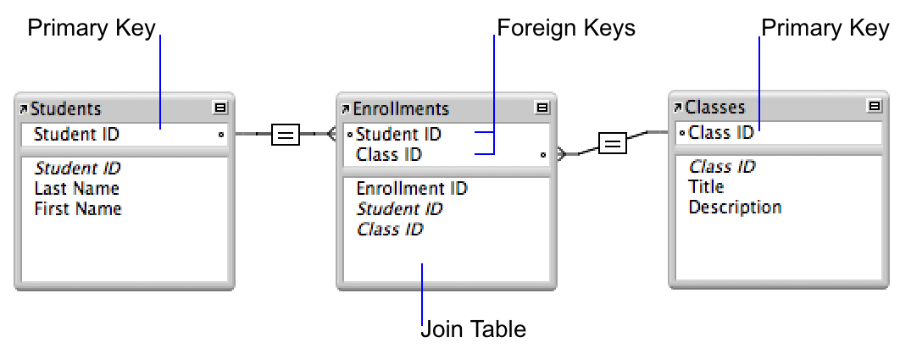

## What is an ER Diagram?
**Answer:** ERD, or entity relationship diagram, is a graphical representation of how tables in a database connect to each other.
Entity relationship diagrams are basically just boxes (your entities, or tables) connected with lines (the relationships between them).

## What is Key Components of an ERD?
**Answer:**
- **Entities:** Represented by rectangles; these are real-world objects or concepts (e.g., Student, Course, Product).
- **Attributes:** Properties of an entity (e.g., StudentID, CourseName).
- **Relationships:** Lines connecting entities, showing how they relate (e.g., a Student enrolls in a Course).
- **Cardinality:** Special line endings (like crow's feet) that specify the number of instances of one entity related to another (e.g., one-to-many, many-to-many).

## Why use a one-to-one relationship?
**Answer**
In a one-to-one relationship, each record in one table or entity is connected to only one record in another table or entity—and vice versa. 
**use**
- To separate optional or sensitive data
- To improve organization and clarity
- To manage performance
## To show a one-to-one relationship in an Entity Relationship Diagram, you use a combination of Entities (boxes), Relationship line,  Cardinality and participation notations

## What Is a One-to-Many Relationship?
**Answer**
A one to many relationship describes a situation where one record in a table can be associated with many records in another.
**For instance**, one customer can place many orders, or one department can have many employees. These relationships are common and necessary in real-world systems.

- In ER diagrams, one-to-many relationships are usually shown with a straight line ending in a “crow’s foot,” which represents the “many” side.
**Crow’s Foot Notation**
Crow’s Foot notation uses symbols at the ends of relationship lines to denote cardinality.
- A straight line ending (|) at the “one” side.
- A three-pronged “crow’s foot” at the “many” side.

**Chen Notation**
In Chen notation, entities are depicted as rectangles, and relationships are shown as diamonds connecting these entities.
- A “1” near the entity on the “one” side.
- An “N” near the entity on the “many” side.

**UML Notation**
In Unified Modeling Language (UML), relationships are shown as lines connecting classes (entities), with multiplicity indicators at each end.
- “1” near the class on the “one” side.
- “*” (asterisk) near the class on the “many” side.

## What is a Many-to-One Relationship in DBMS?
**Answer**
When one or more entries in one table may be linked to each record in the other table, this is known as a Many-to-One relationship.

 It describes the connection between the two entities, Student and Project. As a result, the relationship is Many-to-One.

 ## What is a Many-to-Many Relationship in DBMS?
 **Answer**
 A many-to-many relationship occurs when multiple records in a table are associated with multiple records in another table.
 
